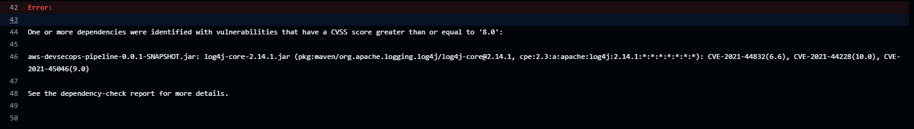

# 🔐 AWS DevSecOps Pipeline

> Security-first CI/CD pipeline that automatically scans for vulnerabilities, hardcoded secrets, and CVEs on every git push blocking deployment if any critical issue is found.

---

## 🏗️ Architecture

```
git push
    │
    ▼
┌─────────────────────────────────────────────────────┐
│                  GitHub Actions                      │
│                                                      │
│  1. GitLeaks      → scan for hardcoded secrets       │
│  2. OWASP DC      → scan dependencies for CVEs       │
│  3. Trivy         → scan Docker image for CVEs       │
│                                                      │
│  ✅ All pass → deploy to AWS                         │
│  🚨 Any fail → pipeline stops, deployment blocked    │
└──────────────────────────┬──────────────────────────┘
                           │
                    ┌──────▼──────┐
                    │  AWS ECR    │
                    │   :latest   │
                    └──────┬──────┘
                           │
          ┌────────────────▼────────────────┐
          │         AWS VPC (ap-south-1)     │
          │                                  │
          │   ALB → EC2 (t3.micro) :8080    │
          │         Ubuntu 22.04, 20GB       │
          └──────────────────────────────────┘
```

---

## 🚀 Tech Stack

| Layer | Technology |
|---|---|
| **Application** | Spring Boot 3.5, Java 21 |
| **Containerization** | Docker, AWS ECR |
| **Infrastructure** | Terraform |
| **Compute** | AWS EC2 (t3.micro) |
| **Load Balancing** | AWS Application Load Balancer |
| **CI/CD** | GitHub Actions |
| **Secrets Detection** | GitLeaks |
| **Dependency Scan** | OWASP Dependency Check |
| **Image Scan** | Trivy |
| **OS** | Ubuntu 22.04 LTS |

---

## 🔐 Security Gates

### 1. GitLeaks Secrets Detection
Scans entire git history for hardcoded secrets, API keys, passwords, and tokens. Pipeline fails immediately if any are found.

### 2. OWASP Dependency Check
Scans all Maven dependencies against the NVD (National Vulnerability Database). Fails if any dependency has a CVSS score ≥ 8.0 (High/Critical).

### 3. Trivy Container Image Scan
Scans the built Docker image for OS-level and library-level vulnerabilities. Blocks deployment on any CRITICAL severity CVE.

---

## 🚨 Security Gate in Action

Pipeline blocked a deployment containing **Log4Shell (CVE-2021-44228, CVSS 10.0)**



```
CVE-2021-44228 (10.0) ← Log4Shell       CRITICAL - BLOCKED 🚨
CVE-2021-45046 (9.0)  ← Log4Shell variant  HIGH  - BLOCKED 🚨
CVE-2021-44832 (6.6)  ← Log4j RCE        MEDIUM - FLAGGED ⚠️
```

> This is the exact vulnerability that compromised thousands of servers in December 2021. This pipeline would have blocked it before it ever reached production.

---

## 🚀 CI/CD Pipeline Flow

```
git push origin main
       │
       ▼
GitHub Actions
       │
       ├── Build JAR (Maven)
       ├── 🔐 GitLeaks scan → fail if secrets found
       ├── 🔐 OWASP scan → fail if CVSS >= 8.0
       ├── Build Docker image
       ├── 🔐 Trivy scan → fail if CRITICAL CVEs found
       ├── Push to AWS ECR
       └── Deploy to EC2 via SSM
```

---

## 📁 Project Structure

```
aws-devsecops-pipeline/
├── src/
│   └── main/java/com/devops/aws_devsecops_pipeline/
│       ├── AwsDevsecopsPipelineApplication.java
│       └── SecurityController.java
├── terraform/
│   └── main.tf          # VPC, ALB, EC2, ECR
├── .github/
│   └── workflows/
│       └── deploy.yml   # DevSecOps pipeline
├── assets/
│   └── owasp-blocked.png
└── Dockerfile
```

---

## 🔌 API Endpoints

| Endpoint | Description |
|---|---|
| `GET /api/hello` | Returns server info + security status |
| `GET /api/health` | Health check |
| `GET /actuator/health` | Spring actuator health |
| `GET /actuator/prometheus` | Prometheus metrics |

### Sample Response - `/api/hello`
```json
{
  "pipeline": "devsecops",
  "message": "Hello from DevSecOps Pipeline!",
  "server": "ip-10-0-1-123",
  "timestamp": "2026-06-17T06:45:15.028",
  "status": "secure"
}
```

---

## 🛠️ Infrastructure (Terraform)

```bash
cd terraform
terraform init
terraform apply    # provisions everything
terraform destroy  # tears down everything
```

**Resources provisioned (19 total):**
- VPC + 2 Public Subnets (ap-south-1a, ap-south-1b)
- Internet Gateway + Route Tables
- Security Groups (ALB + EC2)
- Application Load Balancer + Target Group
- EC2 Instance (t3.micro, Ubuntu 22.04, 20GB gp3)
- ECR Repository
- IAM Role + Instance Profile (ECR + SSM access)

---

## ⚙️ Setup & Deployment

### Prerequisites
- AWS CLI configured
- Terraform installed
- Docker installed
- Java 21

### GitHub Secrets Required
| Secret | Description |
|---|---|
| `AWS_ACCESS_KEY_ID` | AWS credentials |
| `AWS_SECRET_ACCESS_KEY` | AWS credentials |
| `INSTANCE_ID` | EC2 instance ID |

### Deploy
```bash
# 1. Clone
git clone https://github.com/Sumeet-Y1/aws-devsecops-pipeline

# 2. Provision infrastructure
cd terraform && terraform apply

# 3. Add GitHub secrets

# 4. Push code → pipeline auto-scans and deploys!
git push origin main
```

### Destroy
```bash
aws ecr delete-repository --repository-name aws-devsecops-pipeline --force --region ap-south-1
cd terraform && terraform destroy
```

---

## 👤 Author

**Sumeet** - [GitHub](https://github.com/Sumeet-Y1)